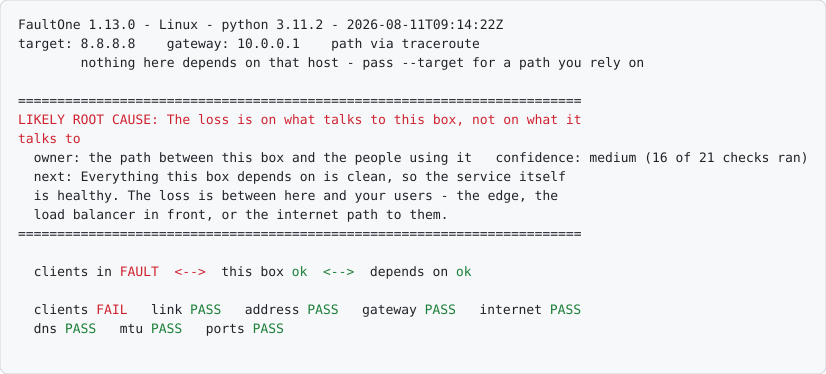

# FaultOne

**201 findings it can reach. One line saying which one to fix first.**

```bash
python3 faultone.py --report                    # what's wrong, in this terminal
python3 faultone.py --report --quick            # the essentials, ~2s
python3 faultone.py --export report.html        # the same run, as one page
python3 faultone.py --report --target 10.0.0.20 # aim at a real dependency
```

Python 3.9 or newer, and nothing else. The full check is ~7s where the path
answers a traceroute.

`--target` matters more than it looks: everything measured off the box is
measured to one host, so it decides what the verdict is about. If the box
exists to reach a database, aim at the database. If its users just need the
internet, aim at a site they actually use and name the port, which checks
the whole chain a browser needs rather than only whether packets return:

```bash
python3 faultone.py --report --target www.google.com --check-ports 443
```

That resolves the name, reaches it, completes TCP 443 and shakes hands over
TLS, and it reports who issued the certificate. An issuer that is not the
site's own is something re-signing traffic in the middle.
[Which host to pick, and why.](REFERENCE.md#choosing-a-target)

You're SSH'd into a box and something is broken. **Is it this box, the way in,
or the way out?** FaultOne runs the checks you'd run by hand, then does the part
that actually takes experience: it works out which fault is the **cause** and
which are its consequences, and names who owns it.

The name is the promise: one fault to act on, not a list to triage. It will
still tell you if something unrelated is also broken; it just won't make you
work out which of the two to start with.

It fits two shapes of box and tells them apart on its own:

- **a box that only talks outward**: an appliance at a customer site, a
  jump host, a worker. There is no way in, so the question is this box or
  everything past it.
- **a box that answers requests**: a proxy, an API server, anything with
  clients connected. Now there are two directions, and they have different
  owners: the loss your users see and the loss your database sees are not the
  same fault.

<picture>
  <source media="(prefers-color-scheme: dark)" srcset="docs/hero-dark.svg">
  
</picture>

Three boxes and an arrow answer *where* before anything asks you to know what a
layer is. On a box nothing connects to, the first one reads `none connected` and
the strip below carries the detail.

The strip reads in the same order: the way in, then the box, then the way out.
Note what it does **not** say here: `internet PASS`, because what this box
connects out to is fine. The fault is on the traffic arriving at it, and that is a
different direction with a different owner.

Under the boxes the same question is asked again with the measurements
attached: **one column per side, carrying the leg out and the leg back**, which
is the pair you are comparing when you ask which direction stopped. A leg reads
`OK`, `SLOW`, `FAULT`, or `NOT MEASURABLE` - the last being a refusal rather
than a reading, because the only proof that what this box sent arrived is
something coming back about it, and when nothing is coming back that proof is
what is missing.

Each column also carries **the hops to one destination on that side**, traced to
a peer the connections actually use rather than to `--target`, and it says which
peer it picked and why. [How that choice is made.](REFERENCE.md#which-destination-gets-traced-and-why-that-one)

One Python file. Nothing to install, nothing left behind, no port opened.

## Use it

The four commands at the top are the whole tool. Everything here is optional.

**What it aims at.** By default (`--target auto`) a box with clients connected
is diagnosed against **the backend it depends on most** (read off its own open
connections), because whether a service can reach its database matters more
than whether it can reach `8.8.8.8`. A box with no clients connected falls back
to `8.8.8.8`. Either way the report names what it chose and why, and
`--target host` overrides it.

> [!TIP]
> **Can't copy files onto the box?** Pipe it in. It runs from memory and
> leaves nothing behind:
>
> ```bash
> ssh -C -J jump user@box "python3 - --report" < faultone.py
> ```

`-C` because OpenSSH doesn't compress by default, and the file is 1089 KB of
repetitive text: it goes over the wire at 329 KB with compression on, for the
cost of one flag.

**On a painfully slow console?** Comments and docstrings are about a quarter of
the file. The standard library will drop them for the trip: no build step, no
second version to keep in step, same behaviour:

```bash
python3 -c "import ast;print(ast.unparse(ast.parse(open('faultone.py').read())))" > /tmp/faultone.py
ssh -C -J jump user@box "python3 - --report" < /tmp/faultone.py    # 225 KB on the wire
```

That needs Python 3.9 on **your** machine, and so does the box.
Stripped and compressed together it's 225 KB instead of 1089. That is 79%
less, which is just over sixteen minutes down to under four on a 9600-baud
console (8N1, so 960 bytes a second), and nothing you'd notice on anything
faster.

**Where the report goes** is a separate choice from what it looks at. Two
flags, and they compose:

```bash
python3 faultone.py --report                       # to this terminal
python3 faultone.py --export report.html           # to a file, and says where
python3 faultone.py --report --export report.html  # both, from one run
```

The format follows the extension. `.html` carries the viewer inside it, so it
opens on any machine with nothing installed: double-click and you have the
verdict, which direction the fault is on, the hop-by-hop path and the evidence
behind all of it. It follows your system's light or dark setting, prints to
paper properly, and opens from the keyboard. `.json` is the data on its own,
which is what `--baseline` reads on the next visit and what you paste through
a terminal.

Every other flag applies to all three. A run aimed somewhere specific exports
exactly like any other:

```bash
python3 faultone.py --export db.html --target 10.0.0.20   # that path, as a page
python3 faultone.py --report --export db.json --target 10.0.0.20 --soak 120
```

**Getting it off a box you can barely reach.** Most of an export is the
captured output of every command, kept so a conclusion can be audited later.
`--export-compact` drops the evidence behind everything that *passed*:

```bash
python3 faultone.py --export-compact report.json    # ~5 KB instead of ~120 KB
```

Same verdict, same findings, same hop diagram, same stage strip: all of that is
derived and none of it is what makes an export big. What's kept is the evidence
behind the stages that aren't passing, plus any check that couldn't run, because
a gap in coverage has to stay visible or it reads as a pass.

**No way to copy a file off at all?** No `scp`, no outbound connection, nothing
to install. But you can always read the screen:

```bash
python3 faultone.py --export-compact -              # one line, on stdout
```

Triple-click it, copy, and paste it into the box in the viewer's sidebar, or
drop the `.json` onto `static/index.html`. SSH sends characters and your own
terminal draws them, so the selection never involves the box, which is exactly
why this works where a file transfer doesn't. It comes out on one line so a
single click takes all of it, and the viewer copes with the wrapping and with a
stray shell prompt either side.

Either way there's no server, no internet, and nothing installed on either
machine.

## Eight flags worth knowing

| | |
|---|---|
| `--quick` | Skips the traceroute and path MTU, the slow parts. Use it when someone's on the phone, or where the path answers no traceroute at all and the full check waits out a 60-second timeout. |
| `--soak 120` | Watches for two minutes instead of taking a snapshot. Use it for faults that come and go. |
| `--target auto` | The default. On a box that accepts connections, aims at the backend it depends on most rather than at 8.8.8.8, and re-owns the verdicts accordingly. |
| `--uplink-mbps 50` | The site's line rate, off the ticket. Without it the tool measures against the NIC's speed and can blame the carrier for a line the site is filling itself. |
| `--baseline old.json` | Compares against a previous visit and tells you what changed. |
| `--check-ports common` | Checks 22, 53, 80, 443, 8080 without typing them out. |
| `--inventory` | Lists the neighbours this device already knows, off its own ARP table. Nothing is scanned or probed; the only traffic it adds is a reverse-DNS lookup per neighbour, to a resolver already configured here. |
| `--export-compact` | An export without the evidence behind the checks that passed. Around a twentieth of the size, same picture. |

[Every flag is listed here.](REFERENCE.md#every-flag)

## Why the ranking is the point

Every tool in this category collects more than this one does. None of them
decides, from the same counters, which fault is the cause, and that decision is
where the wrong answer usually comes from, because the obvious reading of the
evidence is often wrong.

Five cases where a competent engineer, looking at exactly the same numbers,
reaches the wrong conclusion:

| The evidence says | The obvious answer | What the ordering says |
|---|---|---|
| CRC errors climbing | replace the cable | collisions on a **full-duplex** link mean the switch port disagrees about duplex; no cable fixes that |
| Every destination lossy | your link is bad | the box's own receive backlog is overflowing: too busy, not broken |
| Retransmissions high | the path is dropping | the far end acknowledged data it already had, so this is reordering, not loss |
| Certificate won't validate | renew the certificate | it isn't valid *yet*, which is almost always this device's clock |
| Clients losing traffic, and so is the database | one problem, upstream | two problems facing opposite ways; neither explains the other, and fixing one leaves the other exactly where it was |

The rule is one sentence: **a broken layer makes every layer above it look
broken, so the lowest layer with a live fault is the cause and the rest are
symptoms.** A dead gateway with failing DNS on top reports the gateway.

That rule is right, and it is right *within a direction*. Layer and direction
are separate axes, so every finding also carries which way it faces: the way
in, this box, or the way out. A fault facing one way can neither explain nor
corroborate one facing the other, and this box faces both. Without that, client
loss and backend loss are both layer 3 and the tool named one while presenting
the other as its consequence.

```
                         a fault is reported
                                  |
                  which way does the evidence face?
                                  |
      +---------------------------+---------------------------+
      |                           |                           |
 the way in                this box                  the way out
 (downstream)              (local)                   (upstream)
      |                           |                           |
 clients cannot get in     its own link, NIC,        it cannot reach what
 or are turned away:       stack, clock, and the     it connects out to:
 the accept queue,         queues it drops           gateway, DNS, the
 SYN cookies, and the      packets into              path out, a backend,
 certificate it serves                               a certificate
      |                           |                           |
      |                    explains both ways, so             |
      |                    it is the cause whenever           |
      |                    it is present                      |
      |                           |                           |
      +----- neither explains nor corroborates the other -----+
```

Within any one branch the layer rule applies as normal: the lowest layer with a
live fault is the cause, and everything above it is a symptom. `FINDING_SIDE`
is the table that puts each finding on a branch. An unlisted code falls back to
`local`, which is the safe answer because it faces both ways. But a test fails
on any emitted code the table doesn't name, so that fallback stays a decision
somebody made rather than one nobody noticed.

What it doesn't claim: it applies one plausible ordering, consistently; it
doesn't know your network. It still says *likely*. It tells you how much of
itself managed to run, names faults it can't explain, and refuses to call
something loss when the sample can't support it:

```
  owner: capacity, not a fault   confidence: medium (16 of 18 checks ran, 2 explained by it)
  next: Nothing here is faulty. Either the link is undersized for the traffic
  or something is consuming more than it should.
  this also accounts for: inet_partial_loss, call_quality_degraded
  also, unrelated: The certificate on 8.8.8.8:443 expired 40 day(s) ago
```

Both halves matter. The line above says the packet loss and the poor call
quality are **this fault's symptoms**: fix the saturated link and they go with
it. The line below says the expired certificate is **not**: it will still be
expired afterwards. Getting that backwards is how a report sends someone to
their carrier about a fault on their own box.

No model is involved. `VERDICT_RULES` is an ordered list you can read, and
every verdict cites the findings it came from. [The rules, and the numbers
behind them.](REFERENCE.md#why-the-ranking-is-the-point)

**Where does the ordering come from?** It is validated against closed
vocabularies other people maintain - ITU-T X.733 for event types and probable
causes, Batfish's flow dispositions for every way a packet can end, HAProxy's
check statuses, RFC 4898 for what limits a TCP connection, RFC 2680/3393/5481
for how loss and delay variation are defined, the kernel's `SKB_DROP_REASON_*`
for why it drops a packet, and the IANA registries - and twice it turned out to
have reached the standard on its own.

## The evidence it ranks

Two axes, because they answer different questions. **Which layer** decides what
explains what:

| Layer | Checks | Answers |
|---|---|---|
| **L1** Physical | address present, error/CRC counters, collisions, carrier flaps, speed & duplex, fibre optical power | Is this device's own link healthy? |
| **L2** Data link | ARP table, gateway reachability, MTU, LLDP switch port, receive-backlog drops | Is the local segment healthy, and is this box keeping up with it? |
| **L3** Network | routing, gateway, internet, traceroute, path MTU, checksum errors, call quality | Does traffic leave the site and arrive intact? |
| **L4** Transport | listening ports, socket states, TCP port checks, per-connection loss and stalls, connection tracking, accept queues, connection setup, ephemeral ports, file descriptors | Is the service reachable, and is this device's own stack in the way? |
| **L7** Application | DNS and each resolver, TLS handshake and certificate, the certificate this box serves, clock synchronisation | Do names resolve, and does the service actually work? |

**Which direction** decides who owns it:

| Direction | Checks | Answers |
|---|---|---|
| **the way in** | loss and latency on clients' own connections, the load balancer in front, accept queues, SYN cookies and backlog, file descriptors, the certificate this box serves | Can people reach this box, and does it answer them? |
| **this box** | its link, hardware, kernel log, drops, connection tracking, socket memory, clock | Is the box itself in the way? |
| **the way out** | backends, DNS, the hop-by-hop path, path MTU, ephemeral ports, egress | Can it reach what it needs to answer them? |

The two ceilings show why this is not cosmetic: running out of **file
descriptors** stops a box *accepting*, running out of **ephemeral ports** stops
it *opening*. Both are "it ran out of something", and they break opposite
directions.

### What it actually checks

**42 things are inspected. 199 conclusions can come out of them: 34 of those
are context and the other 167 are faults, ranked against each other. One comes
back as the answer, with a name against it.**

That last step is the product. Collecting more is easy and every tool in this
category collects more than this one; deciding which of the things you found is
the *cause* and which are its consequences is the part that takes experience,
and it is the part that is missing everywhere else.

*On the device:* interfaces and addresses · routing table and default gateway ·
interface error, drop, CRC and collision counters · how often the link has
dropped and returned · what the kernel logged and when · packets this device
drops itself · connection tracking table pressure · link speed, duplex and
MTU · optical power and alarms on fibre · which switch port you're on
(LLDP/CDP) · ARP/neighbour table · TCP socket states · TCP retransmission
counters · per-connection TCP loss and stalls, broken down by destination ·
clock synchronisation · CPU thermal throttling · bonded interface members ·
the neighbour table against its own ceiling · listening ports · neighbour
inventory

*Serving traffic, if anything is connected:* who is connected and through
which load balancer · loss and latency on clients' own connections, separately
from backends' · the certificate this box serves · accept queues and SYN
cookies · half-open connections against the listen backlog · ephemeral ports
and file descriptors · why connections were aborted

*Off the device:* gateway reachability and loss · target reachability and loss ·
hop-by-hop path · a TCP path when the normal one is filtered · path MTU · DNS
resolution · each configured resolver individually · TCP reachability of
specific ports · TLS handshake and certificate

*Worked out from those, not separately collected:* call quality (MOS), where
your network ends and the provider's begins, per-hop latency and jitter, link
utilisation, which side of this box a fault is on, what changed since a
previous visit, and what the outbound connections are actually for - the
control plane this box enrols with, the logs it ships elsewhere, and the
traffic it brokers, which are three different things in one column.

[The same list with what each one catches.](REFERENCE.md#what-a-check-means-here-and-how-many-there-are)

Those are the inputs, not the product. A tool with twice as many checks and no
ordering hands you twice as much to read and no answer.

## What you need

**Python 3.9 or newer, and nothing else.** No packages, no virtualenv, no
build. It works on Linux, macOS and Windows; Linux is the best-supported
target.

If the box has something older, it says so and stops rather than failing
halfway through a check. If Python is upgraded on the box later, nothing here
needs changing. Only the standard library is used, and every report records
which interpreter produced it, so a `--baseline` across an upgrade tells you
the interpreter changed instead of blaming the network.

If `mtr`, `ethtool`, `lldpd` or `tcptraceroute` happen to be installed it uses
them for better data: per-hop loss, negotiated duplex, which switch port
you're plugged into. If they aren't, it says less and carries on.

**Several checks read Linux-specific counters and stay silent elsewhere**: the
per-connection breakdown (`ss`), carrier flap history, receive-backlog and
accept-queue drops, connection tracking, and the TCP extended counters behind
the checksum and connection-setup findings. The clock check needs one of
`chronyc`, `timedatectl` or `ntpq` to be present. On macOS or Windows those
report that they couldn't run rather than that nothing is wrong, and the
verdict's confidence drops accordingly, which is the honest answer, since less
of the tool ran.

**A check that can't run is never reported as a fault.** Missing `ifconfig`
gives you "couldn't read the interface list", not "this device has no IP
address". A false diagnosis is worse than a gap.

## Security, and the reports

It never opens a port and never listens for anything. There's no server to
secure. It does run real commands with your privileges.

> [!WARNING]
> A report is a **map of the network it was taken on**: internal addressing,
> MAC addresses, switch names, VLANs, resolvers, listening ports. Exports are
> written `0600` for that reason. Treat one like a network diagram: fine in a
> ticket, fine with the people who own that network, **not** committed to a
> repository or pasted somewhere public. `.gitignore` here covers
> `report.json` and `report.html`, but it can't know what you named yours.

[Full security notes.](REFERENCE.md#security)

## Licence

MIT. See [LICENSE](LICENSE). Use it, change it, ship it inside whatever you
like; it comes with no warranty.

Nothing is vendored, so no other licence travels with the file. The optional
tools it can use (`mtr`, `ethtool`, `lldpd`, `tcptraceroute`) are run as
separate programs, never linked or copied in.

## How the ranking is kept honest

Anyone can write checks. The claim worth making is that the checks are
themselves checked, and these are the numbers behind it:

- **1892 tests**, and a test that fails if any of them asserts nothing at all.
- **300 mutations**, each one breaking a rule on purpose. Every one has to make
  a test fail; a mutation that survives means the rule is not really covered,
  and it is treated as a defect in the suite rather than a curiosity.
- **201 scenarios**, one per finding, driven through the whole pipeline - and
  a test that fails if a finding has no scenario or can never be the answer.
- **500 random combinations** of real findings per run, held to the rules that
  only exist *between* findings: a consequence never outranks its cause, a
  fault facing one way never explains one facing the other, and one report
  names one cause.
- **118 thresholds**, each documented with the reasoning for its value, and a
  test that fails if a number is compared against and never explained.

None of that proves the tool is right - it proves it is consistent, and that a
change cannot quietly alter what it concludes. Being *right* is what the
vocabularies above are for.

## More

- **[REFERENCE.md](REFERENCE.md)**: every check explained, and why it's worth checking
- `faultone.py`: the whole tool
- `static/index.html`: the report viewer, for your machine rather than theirs (regenerate with `--emit-viewer`)
- `test_faultone.py`: `python3 test_faultone.py`, 1892 tests, no dependencies
- `dev/` holds the release harnesses, not part of the tool: every finding through the whole pipeline, and a diff of every scenario against a previous version

Every report records the version that produced it, so a page opened months
later, or a `--baseline` from a previous visit, can be read for what made it.
`python3 faultone.py --version` tells you what's on the box.
